<div align="center">

# 🗓️ Arandu MVP Server
## AI-Powered Intelligent Calendar Backend

<p align="center">
  <em>A sophisticated Spring Boot backend that revolutionizes event planning by integrating artificial intelligence with user events, creating an intelligent calendar experience.</em>
</p>

<p align="center">
  <a href="https://spring.io/projects/spring-boot">
    
  </a>
  <a href="https://spring.io/projects/spring-ai">
    
  </a>
  <a href="https://www.postgresql.org/">
    
  </a>
  <a href="https://www.docker.com/">
    
  </a>
  <a href="https://jwt.io/">
    
  </a>
</p>

</div>

---

## 🚀 Project Overview

**Arandu MVP Server** is the intelligent backend powering a complete calendar application. The core concept revolves around integrating AI models to discover relevant topics within user events and automatically deliver weekly email reports containing:

- 📰 **Latest news** about discovered topics
- 📊 **Detailed reports** describing upcoming user events
- 🎯 **Intelligent insights** and recommendations

---

## 🏗️ Architecture & Core Technologies

### 🤖 AI Integration Layer

#### **Spring AI Framework**
- **Purpose**: Seamless integration with Large Language Models (LLMs)
- **Capabilities**: Direct connection to ChatGPT, Claude, and other AI providers
- **Features**: Vector store integration, conversation memory, and prompt engineering

#### **Model Context Protocol (MCP)**
- **Purpose**: Extends AI capabilities with external tools
- **Integration**: News APIs, email services, and custom workflows
- **Benefits**: Real-time data access and automated task execution

### 🔐 Security & Authentication

#### **Spring Security**
- **Multi-layer Protection**: Comprehensive security framework
- **Features**: Method-level security, CORS handling, and request filtering

#### **JWT (JSON Web Tokens)**
- **Stateless Authentication**: Secure token-based authentication
- **Implementation**: JJWT library with RS256 signing
- **Features**: Token refresh, expiration handling, and claims management

#### **Cookie-based Sessions**
- **Hybrid Approach**: Combines JWT security with session convenience
- **Benefits**: Enhanced user experience with robust security

### 💾 Data Management

#### **PostgreSQL with pgVector**
- **Primary Database**: Robust relational database
- **Vector Extension**: AI-powered similarity search capabilities
- **Use Cases**: Event storage, user data, and vector embeddings

#### **Spring Data JPA**
- **ORM Layer**: Simplified database operations
- **Features**: Repository pattern, query methods, and transaction management

### 🛠️ Development & Productivity Tools

#### **Project Lombok**
- **Code Generation**: Reduces boilerplate code
- **Features**: Automatic getters/setters, builders, and constructors

#### **MapStruct**
- **Object Mapping**: Type-safe bean mapping
- **Performance**: Compile-time code generation for optimal performance

#### **Spring Boot DevTools**
- **Development Experience**: Hot reloading and enhanced debugging
- **Productivity**: Faster development cycles

---

## 🔄 System Workflow

```mermaid
graph TB
    A[👤 User Events] --> B[🤖 AI Analysis]
    B --> C[🔍 Topic Extraction]
    C --> D[📰 News API via MCP]
    D --> E[📧 Email Generation]
    E --> F[📊 Weekly Reports]
    
    G[🔐 Authentication] --> H[🍪 Session Management]
    H --> I[🛡️ Secure API Access]
    
    J[📅 Event CRUD] --> K[🗄️ PostgreSQL Storage]
    K --> L[🔍 Vector Search]
    L --> M[🎯 Smart Recommendations]
```



---

## 🚀 Getting Started

### 📋 Prerequisites

- ☕ **Java 17+**
- 🐘 **PostgreSQL** (with pgVector extension)
- 🐳 **Docker & Docker Compose**
- 🔧 **Maven 3.6+**

### 🏃‍♂️ Quick Start

#### 1. **Database Setup**
```bash
# Start PostgreSQL with pgVector using Docker
docker-compose up -d
```

#### 2. **Environment Configuration**
```bash
# Set required environment variables
export POSTGRES_DB=arandu_db
export POSTGRES_USERNAME=your_username
export POSTGRES_PASSWORD=your_password
export OPENAI_API_KEY=your_openai_key
```

#### 3. **Application Launch**
```bash
# Development mode with hot reload
./mvnw spring-boot:run

# Or build and run
./mvnw clean package
java -jar target/arandu-mvp-server-0.0.1-SNAPSHOT.jar
```

---

## 🎯 Key Features

### 🧠 **Intelligent Event Analysis**
- Automatic topic extraction from user events
- Context-aware content generation
- Personalized insights and recommendations

### 🔗 **MCP Tool Integration**
- **News API**: Real-time news fetching
- **Email Services**: Automated report delivery
- **Extensible Framework**: Easy addition of new tools

### 🛡️ **Enterprise-Grade Security**
- JWT-based authentication with refresh tokens
- Role-based access control
- Secure API endpoints with CORS support

### 📊 **Vector-Powered Search**
- Semantic similarity search using pgVector
- AI-enhanced event recommendations
- Intelligent content matching

---

## 🏛️ Project Structure

```
src/main/java/
├── 🔐 security/          # Authentication & authorization
├── 🤖 ai/               # Spring AI integration & MCP tools
├── 📅 events/           # Event management services
├── 👤 users/            # User management
├── 📧 notifications/    # Email & reporting services
└── ⚙️ config/          # Application configuration
```

---

## 🔧 Technology Stack Summary

| Category | Technology | Purpose |
|----------|------------|---------|
| **Framework** | Spring Boot 3.5.3 | Application foundation |
| **AI Integration** | Spring AI 1.0.0 | LLM connectivity |
| **Database** | PostgreSQL + pgVector | Data storage & vector search |
| **Security** | Spring Security + JWT | Authentication & authorization |
| **Development** | Lombok + MapStruct | Code generation & mapping |
| **Containerization** | Docker Compose | Development environment |
| **Build Tool** | Maven | Dependency management |

---

<div align="center">

**Built with ❤️ using Spring Boot, Spring AI, and cutting-edge AI technologies**

*Transforming calendar management through intelligent automation*

</div>